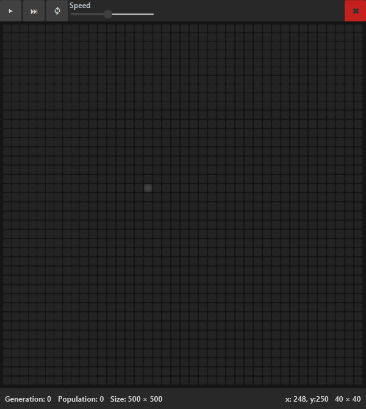
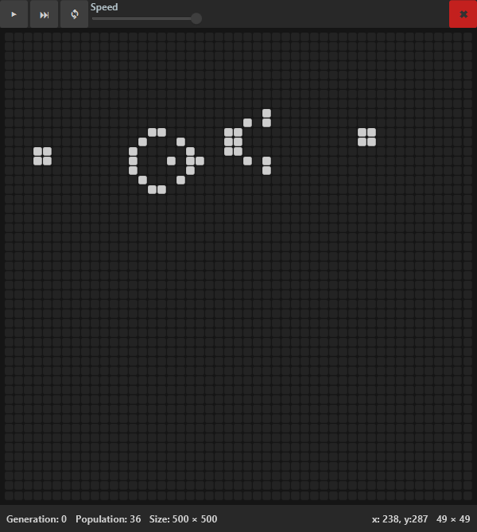

# Game of life

Another implementation of Conway's Game of life written in Kotlin using tornadofx.

## Features

* Big universe size ranging 20x20 to 1000x1000
* Hold to draw/erase multiple cells
* Zoom in/out and dragging view across the board
* Auto-play at user defined speed from 1 tick/s to 10 ticks/s
* Playing one tick at the time
* Statistics about current state of the universe
* Material design

## Dependencies

* TornadoFX (+ JavaFX, obviously)
* JFoenix
